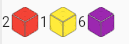

<div align="center">

</div>

# FlutterDicePackage 
> Package for Dice display and launch 

[](#)
[](#)
[](#)
[](#)
[](#-license)

⭐ Star us on GitHub — it motivates us a lot!

## Table of Contents
- [About](#-about)
- [How to Build](#-how-to-build)
- [License](#-license)


## 🚀 About

The current package allows to include a Widget containing Dice (with given color) and to roll them. 
A specific Widget allow to display the result with a minimal form (number and colored cube). 


Two ways of using the Widget are present : direct inclusion or inclusion with a button oppening a dialog box. 


The state is manager by Rivertop. 


## 📝 How to include

After adding the dependency :

```dart
import 'package:FlutterDiceLibrary/dice_package.dart';

   [...]
   Column(
      children: [
        ModalDiceLauncher(diceColors : [Colors.red, Colors.yellow, Colors.purple,  Colors.grey]), //inclusion via modal view
        DicesResult(), // display of result in minimal format 
      ]
   )
   [...]

```

Don't forget to include the Get dependency and the GetMaterialApp on your App (runApp)
Initialise the controller in your main class with 

```dart
import 'package:FlutterDiceLibrary/dice_package.dart';
import 'package:get/get.dart';

void main() {
  Get.put(DiceController());//obligatoire pour initialiser le controller
  // Utiliser GetMaterialApp à la place de MaterialApp pour GetX
  runApp(const MyApp());
}

class MyApp extends StatelessWidget {
  const MyApp({Key? key}) : super(key: key);

  @override
  Widget build(BuildContext context) {
    return GetMaterialApp( //obligatoire dans le cas d'une application avec GetX
      home: Scaffold(
        body: Home(),
      ),
    );
  }
}
```

## Release History

* 0.0.1
    * Work in progress

## Meta

Ellandar31
[https://github.com/ellandar31/FlutterDicePackage](https://github.com/ellandar31/FlutterDicePackage/)

## Contributing

1. Fork it (<https://github.com/ellandar31/FlutterDicePackage/fork>)
2. Create your feature branch (`git checkout -b feature/fooBar`)
3. Commit your changes (`git commit -am 'Add some fooBar'`)
4. Push to the branch (`git push origin feature/fooBar`)
5. Create a new Pull Request

## 📃 License

This product is distributed under an MIT license. See ``LICENSE.md`` for more information.
For non-commercial use, this product is available for free.

[Back to top](#top)
